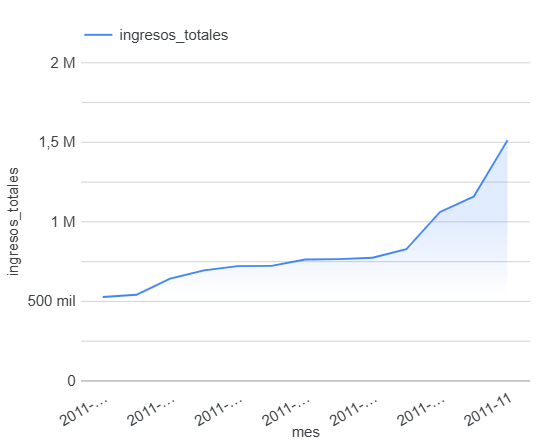

# Análisis de Tendencias de Ventas e Ingresos Mensuales

## 📌 Problema de Negocio
Una tienda minorista en línea del Reino Unido necesitaba comprender su desempeño financiero a lo largo del tiempo para identificar los meses de mayor demanda, optimizar el inventario y planificar campañas de marketing efectivas.

## 🛠️ Herramientas Utilizadas
* **Google BigQuery (SQL):** Para la extracción, limpieza de registros atípicos (cantidades y precios menores o iguales a cero) y agregación de ingresos mensuales.
* **Looker Studio:** Para la creación del panel visual interactivo y análisis de tendencias temporales.

## 📊 Código SQL Utilizado

### 1. Tendencia de Ingresos Mensuales
```sql
SELECT 
  FORMAT_TIMESTAMP('%Y-%m', InvoiceDate) AS mes,
  ROUND(SUM(Quantity * UnitPrice), 2) AS ingresos_totales,
  COUNT(DISTINCT InvoiceNo) AS total_facturas
FROM `tu_proyecto.datos_ventas.online_retail`
WHERE Quantity > 0 AND UnitPrice > 0
GROUP BY mes
ORDER BY mes ASC;
```

### 2. Top 5 Productos Más Vendidos
```sql
SELECT 
  StockCode,
  Description AS producto,
  SUM(Quantity) AS unidades_vendidas,
  ROUND(SUM(Quantity * UnitPrice), 2) AS ingresos_totales
FROM `tu_proyecto.datos_ventas.online_retail`
WHERE Quantity > 0 AND UnitPrice > 0 AND Description IS NOT NULL
GROUP BY StockCode, producto
ORDER BY unidades_vendidas DESC
LIMIT 5;
```

## 📈 Hallazgos Clave y Conclusiones de Negocio



1. **Pico de Ventas Histórico:** El mes con mayores ingresos fue **Noviembre de 2011 (2011-11)**, impulsado por la temporada alta de compras de fin de año.
2. **Tendencia de Crecimiento:** Se observa un crecimiento sostenido en la adquisición de usuarios y volumen de facturación a partir del segundo semestre del año.
3. **Recomendación Estratégica:** La empresa debe asegurar un incremento del 40% en stock de los productos más vendidos desde el mes de septiembre para evitar pérdidas por falta de inventario durante el pico de noviembre y diciembre.
4. **Optimización de Productos Estrella (Top 5):** Identificamos los 5 artículos con mayor rotación de inventario. El producto líder acumula el mayor volumen de unidades vendidas, lo que sugiere que las campañas de descuento cruzado (bundling) deberían construirse alrededor de estos 5 elementos para jalar las ventas de productos menos populares.

